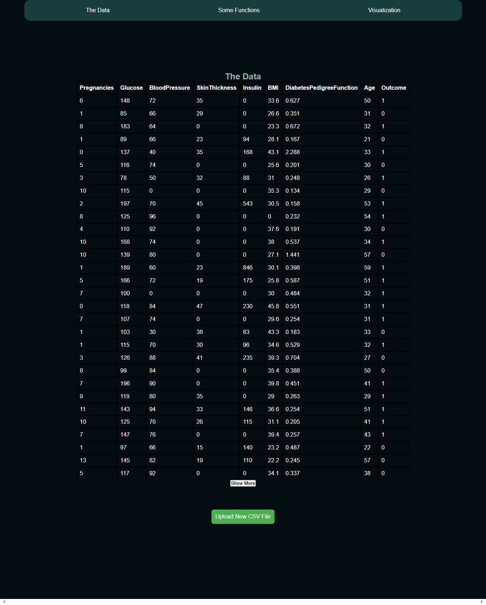

# The Data analysis web application by JS

## Features

- User can upload a CSV file and view its data.

- User can select specific columns to display in the table.

- user can visualize the data using different charts (Bar, Pie, Line).

- User can download the analyzed data as a PDF report.

- User can download the processed data as a CSV file.

## The visualization page

The main part of this project is the "visualization" page which allows users to interact with the data. It uses plotly.js library.

.png>)

The main part of this project is the "Visualization" tab which provides users with various chart types for data representation.

## The data page

The main part of this project is the "data" tab which contains:

- A dropzone for users to import their own datasets.
- A list displaying all uploaded files with options to delete or preview them.

